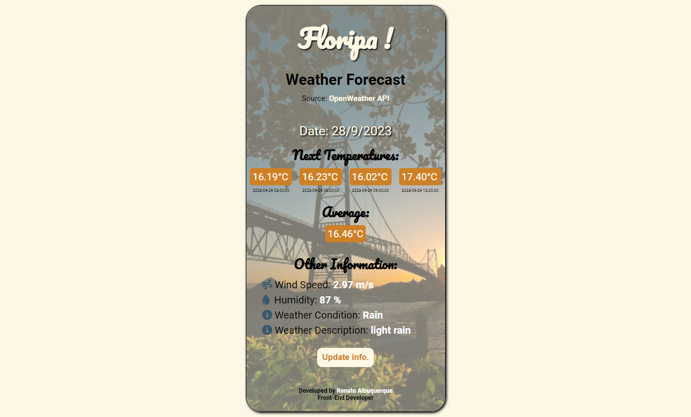

# Floripa Weather Forecast | OpenWeather API

Project: Development of a weather forecast app for the City of Florianópolis, Brazil.
"Mobile First" project developed with HTML, CSS and JavaScript. Responsive page for screen sizes: 320px, 375px, 425px.

Back-End challenge: 
- [x] Consume data from the API: https://rapidapi.com/KirylBokiy/api/openweather43/
- Provide at least two routes to the front-end: 
- [x] Return each of the temperatures, in degrees Celsius, of the next 4 weather forecasts available for the city of “florianópolis”.
- [x] Plus: Below each temperature, show the date/time of the weather forecast.
- [x] Show a field with average temperatures.
- [x] Consume other data from the API, private choice. Ex.: Wind speed, humidity, weather condition and weather description.

Front-End challenge:
- [x] Create the app interface (Display the data obtained by the API in the preferred way).

## Table of contents

- [Overview](#overview)
  - [The challenge](#the-challenge)
  - [Screenshot](#screenshot)
  - [Links](#links)
- [My process](#my-process)
  - [Built with](#built-with)
- [Author](#author)

## Overview

### The challenge

Users should be able to:

- View the optimal layout for the site depending on their device's screen size (Developed for the breakpoints: 320px, 375px, 425px | Mobile First Project)
- See the next 4 weather forecasts available for the city of “florianópolis” and the average
- See wind speed, humidity, weather condition and weather description.

### Screenshot

#### Responsive Viewer

### Links

- [Solution URL here](https://github.com/renato-albuquerque/floripa_weather_forecast-api)
- [Live Site URL here](https://floripa-weather-forecast-api.vercel.app/)

## My process

### Built with

- Semantic HTML5 markup
- CSS custom properties
- Flexbox
- JavaScript
- Mobile-first workflow

## Author

- Business Card - [Renato Albuquerque](https://rma-contacts.vercel.app/)
- Linkedin - [renato-malbuquerque](https://www.linkedin.com/in/renato-malbuquerque/)
- Discord - [Renato Albuquerque#0025](https://discordapp.com/users/992621595547938837)